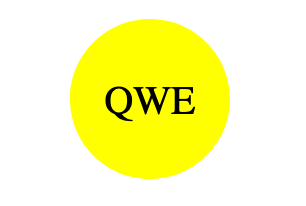
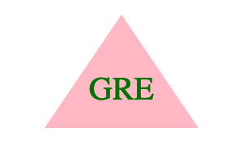

# Command Line Generated Readme.md 
[](https://opensource.org/licenses/MIT)    


--- 
> The Comand Line Logo.svg Generator was developed as a component of the Berkeley Coding Bootcamp Challenge 10. Users can auto generate logo.svg file by providing an input in the command line.
- The example of [logo.svg](./examples/example-circle.svg) includes circle shaped logo. Example-circle.svg is the unmodified version that was originally generated by the Command Line Logo Generator with user's command line input.
- The recorded [video](https://1drv.ms/v/s!Ak2qWe8ZT6ny2FHRS1EzW1b4cEcb?e=oi4XoH) on the screen demonstrates how the Logo Generator operates.

---
## Table of Contents
* [General Information](#general-information)
* [Preview](#preview)
* [Technologies Used](#technologies-used)
* [Installation](#installation)
* [Usage](#usage)
* [Features](#features)
* [Project Status](#project-status)
* [User Story](#user-story)
* [Acceptance Criteria](#acceptance-criteria)
* [Contact](#contact)
* [License](#license)

---
## General Information 
>The main purpose of Comand Line Logo.svg file Generator is to enhance the user experience by providing an easy-to-use tool for generating logos. The development of the application was done accordingly to [user story](#user-story) and [acceptance criteria](#acceptance-criteria). 

---
## Preview 
Circle-shaped logo

 

---
Square-shaped logo


---
Triangle-shaped logo



---
## Technologies Used
-  JavaScript
-  Node.js v18.12.1
-  Inquirer v8.2.5
-  Is-css-color-name v0.1.3
-  Jest v29.5.0

---
## Installation
>To use the `Comand Line Logo Generator`, the user must first [clone](https://github.com/UserOlena/command-line-logo-generator) or [download](https://github.com/UserOlena/command-line-logo-generator/archive/refs/heads/main.zip) the repository to their local computer. Once the repository is successfully located on the computer, the user must install the necessary packages for the application to function. It is essential to have `node.js` installed on the computer, which can be downloaded from the official [web-site](https://nodejs.org/en). It is recommended to download `Node.js v18.12.1` since this application has only been tested with that version. Once `Node.js v18.12.1` is installed, the user should navigate to the `command-line-logo-generator` repository using the command line by typing `cd ~/...` and replacing `...` with the path to the `command-line-logo-generator` directory. Once in that directory, type `npm init -y` in the command line to install `node` modules, `npm i inquirer@8.2.5` to install the `inquirer` package and `npm i is-css-color-name@0.1.3` to install the package that provides a function to check if a given string is a valid CSS color name. It is crucial to ensure that packages are installed within the `command-line-logo-generator` directory, where `index.js` is located. Finally, the user can call the application by typing `node index` in the command line. The istallation of `Jest v29.5.0` package is not required and is only necessary for running tests.

---
## Usage
- To utilize the Command Line Logo Generator, it is necessary to complete all the steps outlined in the Installation section.
- After completing the installation steps, the user can access the Command Line Logo Generator by navigating through the command line to the `command-line-logo-generator` directory where all the necessary `node` modules, the `inquirer` package, and the `index.js` file are located. They can then call the application by typing `node index` in the command line.
- When the user types `node index` in the command line and runs the Command Line Logo Generator, the application will prompt them for input and their choice using a series of prompts.
- The Command Line Logo Generator requires input from the user for all questions. The application will not advance to the next question until the user has provided their input for these questions.
- Once all prompts have been completed and the user has provided input for all questions, the Command Line Logo Generator will generate `logo.svg` file based on the user's choices and inputs.
- After the logo.svg file has been generated, it will be automatically added to the `command-line-logo-generator` directory where the `node_modules`, `inquirer`, and `index.js` files are located. The user can then open the file to check its final look or relocate the file to another directory as desired.
- It's important to note that each time the user runs the Command Line Logo Generator, the previously generated `logo.svg` file will be overwritten. To avoid losing important information that was provided during the prompts, the user must ensure to save the file before starting to generate another `logo.svg` file.

---
## Features 
- The Command Line Logo Generator will automatically apply pre-defined styling to the logo.
- The application includes a validation feature to ensure that all questions have received user input. It will not proceed to the next prompt until the user provides input for these questions.
- The logo can be created in the shape of a `circle`, `square`, or `triangle`.
- The validation feature guarantees that the logo name cannot exceed 3 characters and cannot be empty.
- The validation feature ensures that logo background color keyword (OR a hexadecimal code) and the logo name font color keyword (OR a hexadecimal code) are valid colors that can be applied to the svg file.
- The application incorporates some fundamental tests to ensure that the SVG file is generated correctly based on the acceptance criteria.

---
## Project Status 
>Project is: Complete 

---
## User Story
```md
AS a freelance web developer
I WANT to generate a simple logo for my projects
SO THAT I don't have to pay a graphic designer
```  

---
## Acceptance Criteria
```md
GIVEN a command-line application that accepts user input
WHEN I am prompted for text
THEN I can enter up to three characters
WHEN I am prompted for the text color
THEN I can enter a color keyword (OR a hexadecimal number)
WHEN I am prompted for a shape
THEN I am presented with a list of shapes to choose from: circle, triangle, and square
WHEN I am prompted for the shape's color
THEN I can enter a color keyword (OR a hexadecimal number)
WHEN I have entered input for all the prompts
THEN an SVG file is created named `logo.svg`
AND the output text "Generated logo.svg" is printed in the command line
WHEN I open the `logo.svg` file in a browser
THEN I am shown a 300x200 pixel image that matches the criteria I entered
```  

### Additional Requarements
>The application must include Triangle, Circle, and Square classes, as well as tests for each of these classes using Jest. While not a requirement, it is recommended that you place any common functionality and properties shared by the Triangle, Circle, and Square classes in a parent Shape class and use inheritance to reuse the code in the child classes.

>Each shape class should be tested for a render() method that returns a string for the corresponding SVG file with the given shape color.

>The following example test should pass:

```
const shape = new Triangle();
shape.setColor("blue");
expect(shape.render()).toEqual('<polygon points="150, 18 244, 182 56, 182" fill="blue" />');
```

---
## Contact
-  [Olena P](https://github.com/UserOlena)

---
## License
>This project is open source and available under the [MIT](./LICENSE)